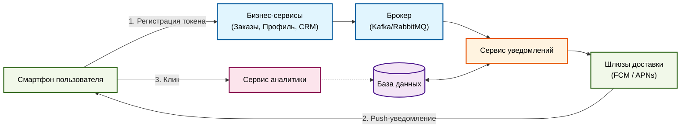

# Решение тестового задания

## ЗАДАНИЕ 1.1
### Противоречия
* **Пункты 2 и 9 (Удаление товара):** П. 2 говорит, что нельзя уменьшить количество ниже 1, то есть удаление товара возможно только отдельной кнопкой для удаления, а в п. 9 сказано, что уменьшение количества до 0 удаляет товар.
* **Пункты 7 и 13 (Цена товара):** П. 7 фиксирует цену при добавлении товара в корзину, а п. 13 требует ее автоматического обновления из каталога при изменении цены.
* **Пункты 10 и 11 (Реклама в корзине):** П. 10 формулирует наличие рекламы как опцию (“может быть”), а п. 11 вводит строгую обязанность по ее отображению (“должна быть”). П. 10 является избыточным, так как п. 11 уже описывает логику работы рекламного блока.

### Недочеты
* **Пункты 1, 3 и 4 (Лимиты):** Математически все верно, но с точки зрения удобства пользования могут быть проблемы. Например, можно взять 5 разных товаров по 10 штук (в сумме 50), но общий лимит - 20. Желательно четко уведомить об этом пользователя, так как интерфейс изначально позволяет набрать товаров больше, чем положено.
* **Пункт 6 (Неинформативная ошибка):** Текст ошибки "Лимит корзины превышен" слишком общий. Пользователь не поймет, что именно он нарушил - количество одного вида товара или суммарное количество товаров в корзине.
* **Пункт 5 (“Вода”):** Фраза "Товары могут быть разные" не несет смысла, так как в п. 3 уже сказано про 5 "различных" товаров.
* **Пункт 8 (Неполнота):** Указана цена за единицу и общая стоимость позиции, но забыта итоговая сумма всей корзины.
* **Пункт 11 (Неточность расписания):** Использование понятий «утро» и «вечер» недопустимо, так как они не являются измеримыми техническими параметрами, вместо них желательно использование конкретных временных интервалов (с N до M часов). Также следует уточнить, какой часовой пояс будет использоваться - серверный или локальный.
* **Нумерация:** Пропущен пункт 12.

---

## ЗАДАНИЕ 1.2
**Противоречие удаления товаров - для грамотного юзабилити следует переписать пункты так:**
* П. 2: Пользователь может изменять количество товара в корзине. При уменьшении количества до 0 позиция автоматически удаляется из корзины.
* П. 9: Для удаления товара из корзины может использоваться отдельная кнопка.

**Противоречие изменения цен в корзине - пункты напрямую противоречат друг другу, следует удалить один из пунктов, тогда останется:**
* Если цена на товар изменилась в каталоге, система должна автоматически обновить ее в корзине у всех пользователей.
* *или*
* Цена на продукт фиксируется на момент добавления в корзину и не меняется.

**Модальное противоречие о рекламе, п. 10 следует убрать, он избыточный, останется:**
* Реклама товаров в корзине должна быть каждый будний день по утрам и вечерам (п. 10 удален как избыточный).

---

## ЗАДАНИЕ 1.3
* Какая модель цен в приоритете? Мы фиксируем цену для повышения лояльности или всегда продаем по актуальной цене каталога, чтобы не терять прибыль?
* Если цена все-таки меняется в корзине (п. 13), как мы уведомляем пользователя?
* Какие конкретные тексты ошибок мы выводим при превышении лимитов в корзине (вместо общей фразы из п. 6)?
* В п. 11 что такое “утро” и “вечер” в цифрах? Нужны точные временные интервалы.
* В п. 11 по какому часовому поясу мы работаем? Используем время сервера или локальное время устройства пользователя?
* Как ведет себя интерфейс в “нерекламное” время? Мы просто скрываем блок (верстка подтягивается) или оставляем пустое место / заглушку с чем-то?
* Что делать, если товар закончился? Если товар в корзине пользователя закончился на складе, должны ли мы его автоматически удалять или перемещать в блок “Отложенные / Нет в наличии”?

---

## ЗАДАНИЕ 2.1
```http
GET /api/v1/partners?lat=55.7558&lon=37.6173&limit=10 HTTP/1.1
Host: api.petrushka.ru
Authorization: Bearer <token>
Accept-Language: ru-RU
```

---

## ЗАДАНИЕ 2.2
```json
[
  {
    "id": "partner_metro_01",
    "name": "METRO",
    "logo_url": "https://petrushka.ru/logos/metro.png",
    "delivery": {
      "title": "Ближайшая доставка",
      "time_text": "сегодня 21:00-23:00",
      "is_express": false
    },
    "external_url": "https://metro-cc.ru/partner/petrushka"
  },
  {
    "id": "partner_auchan_02",
    "name": "Ашан",
    "logo_url": "https://petrushka.ru/logos/auchan.png",
    "delivery": {
      "title": "Ближайшая доставка",
      "time_text": "сегодня 18:00-20:00",
      "is_express": false
    },
    "external_url": "https://auchan.ru/partner/petrushka"
  },
  {
    "id": "partner_vkusvill_03",
    "name": "ВкусВилл",
    "logo_url": "https://petrushka.ru/logos/vkusvill.png",
    "delivery": {
      "title": "Быстрая доставка",
      "time_text": "от 20 до 60 минут",
      "is_express": true
    },
    "external_url": "https://vkusvill.ru/partner/petrushka"
  },
  {
    "id": "partner_victoria_04",
    "name": "ВИКТОРИЯ",
    "logo_url": "https://petrushka.ru/logos/victoria.png",
    "delivery": {
      "title": "Ближайшая доставка",
      "time_text": "сегодня 17:00-19:00",
      "is_express": false
    },
    "external_url": "https://victoria.ru/partner/petrushka"
  }
]
```

---

## ЗАДАНИЕ 3.1

